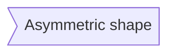
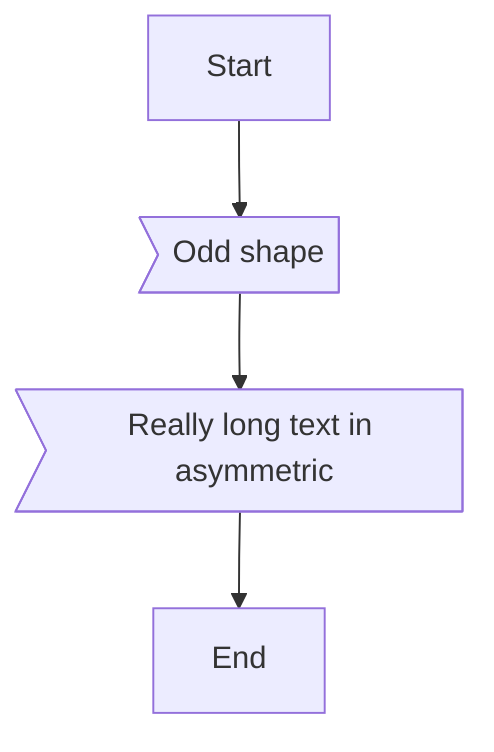

# Flowchart Asymmetric Shape Rendering

## Overview

The asymmetric shape in Mermaid flowcharts (`>text]`) renders as a flag or banner shape with a pointed left side. This document describes the implementation and fixes applied.

## Syntax



The syntax `>text]` creates a node with:
- Pointed/notched left side (like a flag banner)
- Flat right side
- Text centered within the visible portion

## Implementation

### Shape Rendering

The asymmetric shape is a 5-point polygon:

```
     1               2
      *-------------*
     /              |
  5 *               |
     \              |
      *-------------*
     4               3
```

**Points:**
1. Top-left (indented inward)
2. Top-right
3. Bottom-right
4. Bottom-left (indented inward)
5. Left-center (the pointed tip)

### Code Location

- **Parsing:** `parse_node_from_text()` in `flowchart.rs`
- **Rendering:** `draw_node()` match arm for `NodeShape::Asymmetric`
- **Enum:** `NodeShape::Asymmetric` variant

### Key Implementation Details

```rust
NodeShape::Asymmetric => {
    let indent = layout.size.y * 0.25;  // 25% of height
    let points = [
        Pos2::new(rect.left() + indent, rect.top()),
        Pos2::new(rect.right(), rect.top()),
        Pos2::new(rect.right(), rect.bottom()),
        Pos2::new(rect.left() + indent, rect.bottom()),
        Pos2::new(rect.left(), center.y),
    ];
    // ... draw polygon
}
```

### Text Centering

For asymmetric shapes, text is offset to appear visually centered within the visible rectangular portion:

```rust
let text_center = if matches!(node.shape, NodeShape::Asymmetric) {
    let indent = layout.size.y * 0.25;
    Pos2::new(center.x + indent / 2.0, center.y)
} else {
    center
};
```

The offset is `indent / 2.0` to the right, which centers text within the visible area rather than the full bounding box.

## Parsing

The parser identifies asymmetric shapes by checking for `>` and `]`:

```rust
// Asymmetric: >text]
if text.contains('>') && text.contains(']') {
    // Extract ID and label
}
```

**Important:** This check comes after the Rectangle check (`[text]`), so it won't incorrectly match rectangular nodes.

### Dash-Style Edge Label Handling

When asymmetric nodes are used with dash-style edge labels (e.g., `-- label -->`), special handling is required to prevent the label from being included in the node text.

**Problem:** For input like `od>Odd shape]-- Two line<br/>edge comment --> ro`:
1. `find_arrow_pattern()` finds `-->` at the end
2. Everything before `-->` becomes node text: `od>Odd shape]-- Two line<br/>edge comment`
3. This polluted string would fail asymmetric pattern matching

**Solution:** The `extract_dash_label()` function separates the node definition from dash-style labels:

```rust
fn extract_dash_label(node_text: &str) -> (&str, Option<String>) {
    // Find the last shape-closing character (], ), }, |)
    // Check if there's a dash-style label pattern after it (-- , -. , == )
    // Return (cleaned_node_text, extracted_label)
}
```

**Supported patterns:**
- `A[Node]-- label -->` (solid edge with label)
- `A[Node]-. label .->` (dotted edge with label)
- `A[Node]== label ==>` (thick edge with label)

## Testing

Test cases are available in `test_md/test_flowcharts.md`:



### Verification Points

- Shape renders as left-pointing flag/banner
- Text is readable and visually centered
- Long text sizes the node appropriately
- Shape matches Mermaid.live reference rendering

## Related Files

| File | Purpose |
|------|---------|
| `src/markdown/mermaid/flowchart.rs` | Node parsing and rendering |
| `test_md/test_flowcharts.md` | Test cases including asymmetric shapes |
| `docs/technical/flowchart-layout-algorithm.md` | Overall layout system |
