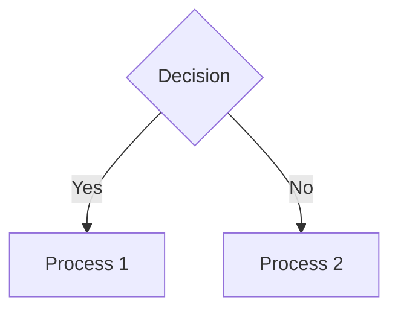

# Flowchart Branch Ordering

This document describes how branch ordering works in Mermaid flowchart rendering.

## Overview

When a flowchart has decision nodes (diamonds) with multiple outgoing edges, the branches are positioned according to edge declaration order in the source.

## Convention

**First-declared branch goes to the primary direction:**
- In **TD/TB** (top-down): First branch goes LEFT
- In **LR** (left-right): First branch goes TOP
- In **BT** (bottom-up): First branch goes LEFT
- In **RL** (right-left): First branch goes TOP

## Example

Result:
- `C` (Yes, declared first) appears on the LEFT
- `D` (No, declared second) appears on the RIGHT

## Implementation Details

### Layer Ordering

Branch ordering is implemented in `flowchart.rs` in two places:

1. **`build_layers()`** - Initial layer construction
2. **`order_layer_by_barycenter()`** - Crossing reduction

Both functions sort nodes within a layer by their position in the predecessor's outgoing edge list:
- Lower position (earlier declaration) → placed first in cross-axis
- Higher position (later declaration) → placed second in cross-axis

### Barycenter Fallback

The crossing reduction algorithm uses barycenter heuristic to minimize edge crossings. For nodes with no connections in a particular direction (like leaf nodes), the algorithm preserves the current layer position instead of using an arbitrary fallback. This ensures the edge declaration order is maintained even after crossing reduction passes.

### Edge Declaration Order

The position of a node in its predecessors' outgoing edge list is determined by the order edges were declared in the source. For chained edges like `A --> B --> C`, edge A→B is added before edge B→C.

## Related Files

- `src/markdown/mermaid/flowchart.rs` - Layout algorithm implementation
- `docs/technical/flowchart-layout-algorithm.md` - Sugiyama algorithm details
- `docs/technical/flowchart-direction.md` - Direction handling (TD, LR, etc.)

## Testing

Test cases cover:
- Simple decision branches (2 outgoing edges)
- Complex trees (coffee machine troubleshooting with 8 nodes)
- Chained edges with branching (chapter flow diagram)
- All four directions (TD, BT, LR, RL)

See `test_layout_td_complex_diagram`, `test_layout_coffee_machine_all_nodes`, and `test_layout_chapter_flow_lr` in `mod.rs`.
