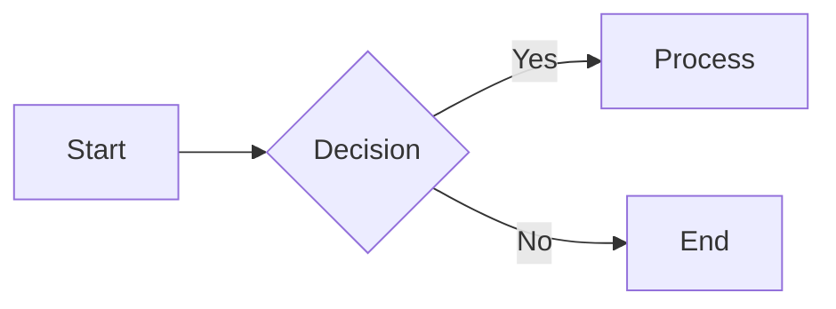
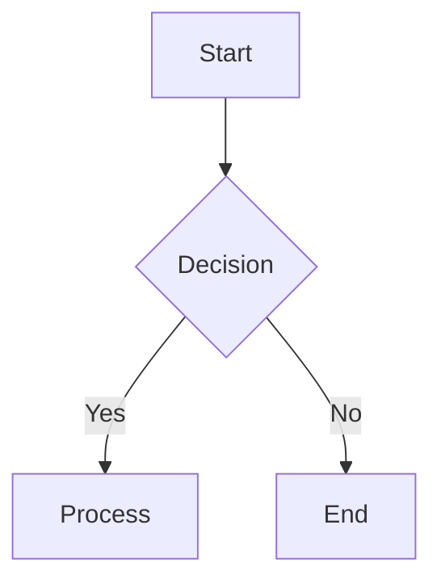

# Flowchart Direction Layout

## Overview

The Mermaid flowchart renderer supports all four standard layout directions:

- **TD/TB** (Top-Down): Nodes flow from top to bottom (default)
- **BT** (Bottom-Top): Nodes flow from bottom to top
- **LR** (Left-Right): Nodes flow from left to right
- **RL** (Right-Left): Nodes flow from right to left

## Implementation

### Direction Parsing

Direction is parsed from the flowchart/graph declaration line:

```rust
// src/markdown/mermaid/flowchart.rs
pub enum FlowDirection {
    TopDown,   // TD or TB
    BottomUp,  // BT
    LeftRight, // LR
    RightLeft, // RL
}
```

The `parse_direction()` function extracts the direction from header lines like `flowchart LR` or `graph TD`.

### Layout Algorithm

The Sugiyama-style layered graph algorithm in `SugiyamaLayout::assign_coordinates()` handles direction through two key transformations:

1. **Axis Swap** (`is_horizontal`): For LR/RL directions, the main axis (layer progression) becomes X and the cross axis (within-layer positioning) becomes Y. For TD/BT, these are reversed.

2. **Direction Reversal** (`is_reversed`): For RL/BT directions, coordinates are flipped after initial positioning to reverse the flow direction.

```rust
let is_horizontal = matches!(direction, FlowDirection::LeftRight | FlowDirection::RightLeft);
let is_reversed = matches!(direction, FlowDirection::BottomUp | FlowDirection::RightLeft);
```

### Coordinate Assignment

For horizontal layouts (LR/RL):
- `current_main` advances along the X axis (through layers)
- `current_cross` positions nodes along the Y axis (within each layer)

For vertical layouts (TD/BT):
- `current_main` advances along the Y axis (through layers)
- `current_cross` positions nodes along the X axis (within each layer)

### Edge Rendering

Edge anchor points are adjusted based on direction in `draw_edge()`:

| Direction | Exit Anchor | Entry Anchor |
|-----------|-------------|--------------|
| TD | Bottom of source | Top of target |
| BT | Top of source | Bottom of target |
| LR | Right of source | Left of target |
| RL | Left of source | Right of target |

## Examples

### Left-to-Right (LR)



Produces a horizontal layout:
- A is leftmost (layer 0)
- B is to the right of A (layer 1)
- C and D are to the right of B (layer 2), stacked vertically

### Top-to-Bottom (TD)



Produces a vertical layout:
- A is topmost (layer 0)
- B is below A (layer 1)
- C and D are below B (layer 2), spread horizontally

## Key Files

| File | Purpose |
|------|---------|
| `src/markdown/mermaid/flowchart.rs` | Direction parsing, layout algorithm, rendering |
| `src/markdown/mermaid/mod.rs` | Public API and tests |

## Tests

Comprehensive tests verify direction handling in `src/markdown/mermaid/mod.rs`:

- `test_parse_direction` - Verifies direction parsing
- `test_layout_left_right_direction` - LR layout produces horizontal flow
- `test_layout_right_left_direction` - RL layout produces reversed horizontal flow
- `test_layout_bottom_top_direction` - BT layout produces reversed vertical flow
- `test_layout_lr_complex_diagram` - Multi-layer LR with branching
- `test_layout_td_complex_diagram` - Multi-layer TD with branching
