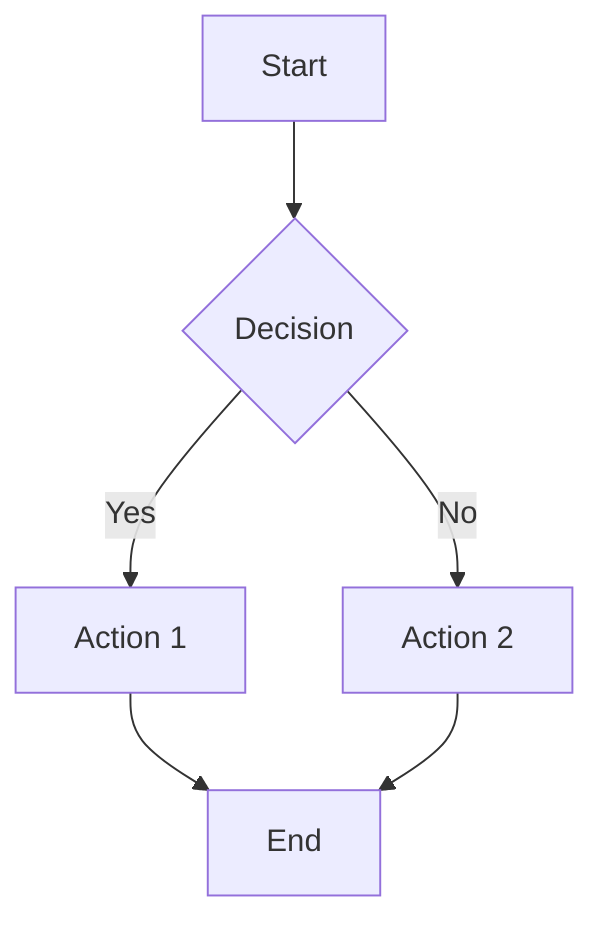

# Flowchart Layout Algorithm

This document describes the Sugiyama-style layered graph layout algorithm implemented in Task 22 for Ferrite's Mermaid flowchart rendering.

## Overview

The layout algorithm transforms a flowchart graph into positioned nodes with coordinates suitable for rendering. It replaces the previous linear layout with a proper graph-based approach that supports:

- **Branching**: Side-by-side placement of nodes in decision branches
- **Cycle handling**: Proper detection and handling of back-edges
- **Crossing minimization**: Reduces visual clutter from edge crossings
- **All directions**: Supports TD, BT, LR, RL flow directions

## Algorithm Phases

### Phase 1: Graph Construction (`FlowGraph::from_flowchart`)

Builds an internal graph representation from the flowchart AST:

- **Node indexing**: Maps node IDs to integer indices for efficient operations
- **Adjacency lists**: Builds `outgoing` and `incoming` edge lists per node
- **Size computation**: Measures text and calculates node dimensions with padding

```rust
struct FlowGraph {
    node_ids: Vec<String>,           // Node IDs in order
    id_to_index: HashMap<String, usize>, // ID → index mapping
    node_sizes: Vec<Vec2>,           // Node dimensions
    outgoing: Vec<Vec<usize>>,       // Adjacency list: node → targets
    incoming: Vec<Vec<usize>>,       // Reverse adjacency: node → sources
    back_edges: Vec<(usize, usize)>, // Detected cycle edges
}
```

### Phase 2: Cycle Detection (`detect_cycles_and_mark_back_edges`)

Uses DFS to identify back-edges that create cycles:

```
Algorithm: DFS-based back-edge detection
1. For each unvisited node, run DFS
2. Track nodes currently in the recursion stack (in_stack)
3. If we visit a node already in_stack → back-edge found
4. Store back-edges for exclusion during layering
```

Back-edges are excluded during rank assignment but still rendered as edges.

### Phase 3: Layer Assignment (`assign_layers`)

Assigns nodes to horizontal/vertical layers using a longest-path BFS approach:

```
Algorithm: Longest-path layer assignment
1. Build effective_incoming edges (excluding back-edges)
2. Compute in-degree for each node
3. Start BFS from nodes with in-degree 0 (roots)
4. For each node visited:
   - Set layer = max(predecessor layers) + 1
   - Decrement in-degree of successors
   - Add successors with in-degree 0 to queue
5. Handle remaining nodes (disconnected/complex cycles)
```

This ensures:
- Sources (no incoming edges) are at layer 0
- Each node is at least one layer after all its predecessors
- Branching nodes have children in the same or subsequent layers

### Phase 4: Crossing Reduction (`reduce_crossings`)

Minimizes edge crossings using the barycenter heuristic:

```
Algorithm: Barycenter crossing reduction
Repeat for N iterations:
  1. Top-down pass (layers 1 to end):
     - For each node, compute barycenter = avg position of predecessors
     - Sort layer by barycenter
  2. Bottom-up pass (layers end-1 to 0):
     - For each node, compute barycenter = avg position of successors
     - Sort layer by barycenter
```

The barycenter is the average position of connected nodes in the adjacent layer. Sorting by barycenter tends to reduce crossings.

### Phase 5: Coordinate Assignment (`assign_coordinates`)

Converts layer assignments and orderings into actual pixel coordinates:

```
Algorithm: Coordinate assignment
1. Calculate cross-axis size for each layer
2. Find maximum cross-axis size for centering
3. For each layer:
   a. Center layer in cross-axis
   b. Position nodes sequentially with spacing
   c. Advance main-axis position
4. Handle reversed directions (BT, RL) by flipping coordinates
```

Key considerations:
- **Main axis**: Direction of flow (vertical for TD/BT, horizontal for LR/RL)
- **Cross axis**: Perpendicular to flow (horizontal for TD/BT, vertical for LR/RL)
- **Centering**: Layers are centered relative to the widest layer

## Configuration

Layout behavior is controlled by `FlowLayoutConfig`:

| Parameter | Default | Description |
|-----------|---------|-------------|
| `node_padding` | (24, 12) | Padding inside nodes around text |
| `node_spacing` | (50, 60) | Space between nodes (x, y) |
| `max_node_width` | 40% of width | Maximum node width before text wrapping |
| `text_width_factor` | 1.15 | Safety margin for text measurement |
| `margin` | 20 | Diagram margin |
| `crossing_reduction_iterations` | 4 | Barycenter iterations |

## Direction Support

The algorithm supports all four Mermaid flow directions:

| Direction | Main Axis | Cross Axis | Description |
|-----------|-----------|------------|-------------|
| TD/TB | Vertical (↓) | Horizontal | Top to bottom |
| BT | Vertical (↑) | Horizontal | Bottom to top |
| LR | Horizontal (→) | Vertical | Left to right |
| RL | Horizontal (←) | Vertical | Right to left |

Reversed directions (BT, RL) are handled by flipping coordinates after initial layout.

## Edge Handling

### Smart Edge Exit Points

For nodes with multiple outgoing edges (like decision diamonds), edges exit from different positions based on target location to prevent crossing:

- **Target to the LEFT**: Exit from left side of source's bottom edge
- **Target to the RIGHT**: Exit from right side of source's bottom edge  
- **Target centered**: Exit from center of source's bottom edge

This prevents the common issue of edges crossing each other when leaving decision nodes.

### Direction-Based Connection Points

| Direction | Normal Edge | Connection |
|-----------|-------------|------------|
| TD | Bottom → Top | Source bottom to target top |
| BT | Top → Bottom | Source top to target bottom |
| LR | Right → Left | Source right to target left |
| RL | Left → Right | Source left to target right |

### Back-Edge (Cycle) Routing

Back-edges are detected during cycle detection and rendered with special curved routing:

```
Algorithm: Back-edge bezier routing (TopDown)
1. Start point: Left side of source node
2. End point: Bottom-center of target node
3. Control points: Create bezier curve that goes:
   - Left from source
   - Up along the left margin
   - Curves into the bottom of the target
```

This provides a visually distinct representation for loop-back edges in flowcharts with cycles.

### Branch Ordering

Nodes at the same layer are ordered based on edge declaration order from their parent:
- Edges declared **later** in the source → targets placed **LEFT**
- This matches Mermaid's convention for decision branches

## Complexity

| Phase | Time Complexity | Space Complexity |
|-------|-----------------|------------------|
| Graph construction | O(V + E) | O(V + E) |
| Cycle detection | O(V + E) | O(V) |
| Layer assignment | O(V + E) | O(V) |
| Crossing reduction | O(iterations × L × max_layer_size²) | O(V) |
| Coordinate assignment | O(V) | O(L) |

Where:
- V = number of nodes
- E = number of edges
- L = number of layers

## Example

Input flowchart:


Layout result:
```
Layer 0:        [A]
Layer 1:        [B]
Layer 2:    [C]   [D]
Layer 3:        [E]
```

C and D are placed side-by-side in layer 2 because they're both children of B and have no direct dependency between them.

## Files

- **Implementation**: `src/markdown/mermaid.rs` (lines 546-1039)
- **Key structs**: `FlowGraph`, `SugiyamaLayout`, `FlowLayoutConfig`
- **Entry point**: `layout_flowchart()` function
