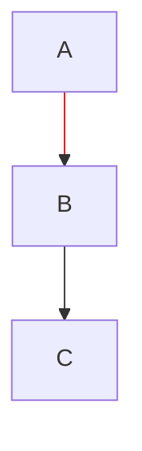

# Flowchart linkStyle Directive

Implements edge styling via the `linkStyle` directive in Mermaid flowcharts.

## Mermaid Syntax



## Supported Properties

| Property | Description | Example |
|----------|-------------|---------|
| `stroke` | Edge color (hex format) | `stroke:#f00`, `stroke:#ff0000` |
| `stroke-width` | Edge width in pixels | `stroke-width:4px`, `stroke-width:2` |

## Implementation Details

### Data Structures

**LinkStyle struct** (`flowchart.rs`):
```rust
pub struct LinkStyle {
    pub stroke: Option<Color32>,
    pub stroke_width: Option<f32>,
}
```

**Flowchart fields**:
```rust
pub struct Flowchart {
    // ... other fields ...
    pub link_styles: HashMap<usize, LinkStyle>,      // index -> style
    pub default_link_style: Option<LinkStyle>,       // default style
}
```

### Parser

The `parse_link_style()` function handles the `linkStyle` directive:
1. Extracts index (numeric) or `default` keyword
2. Parses CSS properties using existing `parse_css_color()` and `parse_stroke_width()`
3. Stores in appropriate field based on index type

### Renderer

In `draw_edge()`:
1. Looks up custom style by edge index
2. Falls back to default_link_style if no specific style
3. Applies custom stroke color and width if specified
4. Arrow heads also use the custom stroke color

## Edge Indexing

Edges are indexed in the order they appear in the flowchart:
- First edge defined = index 0
- Second edge defined = index 1
- etc.

For chained edges like `A --> B --> C`, this creates edges 0 (A→B) and 1 (B→C).

## Precedence Rules

1. Specific index style takes precedence over default
2. Default style applies to edges without specific style
3. If no custom style, theme colors are used

## Related Files

- `src/markdown/mermaid/flowchart.rs` - Main implementation
- `test_md/test_flowcharts.md` - Test cases
- `docs/technical/mermaid-classdef-styling.md` - Similar node styling pattern
