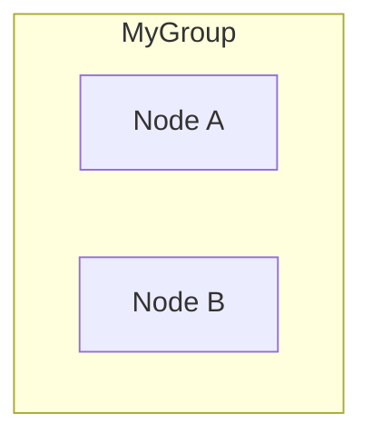
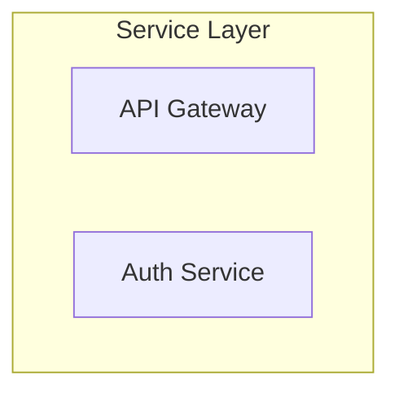
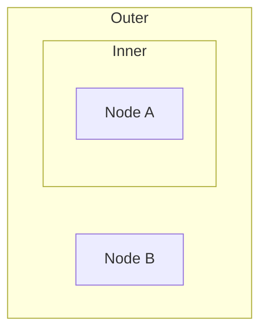

# Flowchart Subgraph Support

This document describes the subgraph (cluster) support implemented in Task 18 for Ferrite's Mermaid flowchart rendering.

## Overview

Subgraphs allow grouping related nodes together in a flowchart with a visual container and optional title. This implementation supports:

- **Basic subgraphs**: `subgraph title` syntax
- **Named subgraphs**: `subgraph id [title]` syntax
- **Nested subgraphs**: Subgraphs within subgraphs
- **Direction overrides**: `direction TB/LR/etc` within subgraphs (parsed, not yet applied)

## Syntax Support

### Basic Subgraph


### Named Subgraph with Title


### Nested Subgraphs


## Implementation Details

### AST Types

```rust
/// A subgraph (cluster) in a flowchart.
pub struct FlowSubgraph {
    /// Unique identifier for the subgraph
    pub id: String,
    /// Display title (may differ from id)
    pub title: Option<String>,
    /// IDs of nodes directly contained in this subgraph
    pub node_ids: Vec<String>,
    /// IDs of nested subgraphs
    pub child_subgraph_ids: Vec<String>,
    /// Optional direction override for this subgraph
    pub direction: Option<FlowDirection>,
}
```

### Parser

The parser handles subgraph blocks using a stack-based approach:

1. When `subgraph` keyword is encountered, push a new `SubgraphBuilder` onto the stack
2. Associate nodes/edges with the current (top of stack) subgraph
3. When `end` keyword is encountered, pop the builder and create the subgraph
4. Register nested subgraphs as children of their parent

### Layout

Subgraph bounding boxes are computed after node positions are determined:

1. For each subgraph (processing children before parents):
   - Calculate min/max bounds of all member nodes
   - Include bounds of nested subgraphs
   - Add padding around content
   - Add space for title at top

```rust
pub struct SubgraphLayout {
    /// Bounding box position (top-left corner)
    pub pos: Pos2,
    /// Bounding box size
    pub size: Vec2,
    /// Title to display (if any)
    pub title: Option<String>,
}
```

### Rendering

Subgraphs are rendered as the first layer (behind edges and nodes):

1. Draw semi-transparent rounded rectangle as background
2. Draw title text in top-left corner if present
3. Parent subgraphs drawn before children to layer correctly

## Configuration

Layout configuration for subgraphs:

| Parameter | Default | Description |
|-----------|---------|-------------|
| `subgraph_padding` | 15.0 | Padding around subgraph content |
| `subgraph_title_height` | 24.0 | Height reserved for title |

## Colors

Theme colors for subgraphs:

| Color | Dark Theme | Light Theme |
|-------|------------|-------------|
| `subgraph_fill` | rgba(60, 70, 90, 40) | rgba(200, 210, 230, 60) |
| `subgraph_stroke` | rgb(80, 100, 130) | rgb(150, 170, 200) |
| `subgraph_title` | rgb(160, 175, 195) | rgb(80, 95, 120) |

## Limitations

1. **Direction overrides**: Parsed but not yet applied to layout
2. **Edge to subgraph**: Edges connecting directly to subgraphs (not individual nodes) are not yet supported
3. **Subgraph styling**: Custom per-subgraph styling is not supported

## Future Enhancements

- Apply direction overrides within subgraphs
- Support edges to/from subgraph ids
- Custom styling per subgraph
- Collapse/expand subgraphs interactively

## Files

- **Implementation**: `src/markdown/mermaid.rs`
- **Key types**: `FlowSubgraph`, `SubgraphLayout`, `SubgraphBuilder`
- **Key functions**: `parse_subgraph_header()`, `compute_subgraph_layouts()`, `draw_subgraph()`
