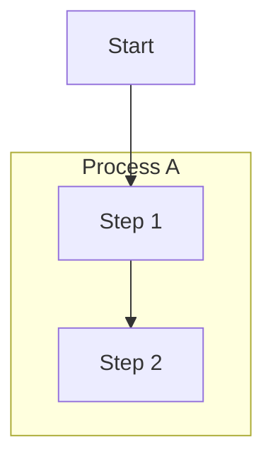

# Flowchart Viewport Clipping Fix

## Overview

Fixed two issues causing flowchart content to be clipped outside the visible rendering area:

1. **Viewport clipping for nested subgraphs** (Task 57) - Subgraphs extending into negative coordinates were clipped
2. **Subgraph node membership** - Nodes referenced before their subgraph definition weren't included in subgraph bounds

## Key Files

- `src/markdown/mermaid/flowchart.rs` - Parsing and layout computation

## Problem 1: Negative Coordinate Clipping

### Root Cause

Subgraphs can have negative positions due to:
- `subgraph_title_height` subtracted from content bounds
- Padding extending above/left of content

The original `total_size` computation only tracked maximum bounds:

```rust
// Old code - only tracked max bounds
layout.total_size.x = layout.total_size.x.max(sg_layout.pos.x + sg_layout.size.x + config.margin);
layout.total_size.y = layout.total_size.y.max(sg_layout.pos.y + sg_layout.size.y + config.margin);
```

Content at negative positions was rendered but clipped outside the allocated viewport.

### Solution

Updated `compute_subgraph_layouts()` to:
1. Calculate true bounds (min and max) across all nodes AND subgraphs
2. Detect when content extends into negative coordinates
3. Shift ALL positions (nodes and subgraphs) to ensure everything starts at `>= margin`
4. Update `total_size` as the span from 0 to max bounds after shifting

```rust
// New code - tracks min/max and shifts if needed
let shift_x = if min_x < 0.0 { -min_x + config.margin } else { 0.0 };
let shift_y = if min_y < 0.0 { -min_y + config.margin } else { 0.0 };

if shift_x > 0.0 || shift_y > 0.0 {
    for node_layout in layout.nodes.values_mut() {
        node_layout.pos.x += shift_x;
        node_layout.pos.y += shift_y;
    }
    for sg_layout in layout.subgraphs.values_mut() {
        sg_layout.pos.x += shift_x;
        sg_layout.pos.y += shift_y;
    }
}
```

## Problem 2: Subgraph Node Membership

### Root Cause

When parsing flowcharts like:



Node `A1` was created by `Start --> A1` **before** the subgraph definition. When later seen inside the subgraph, the parser only updated the label but didn't add the node to the subgraph's `node_ids`.

Result: Only `A2` appeared inside "Process A", while `A1` was outside.

### Solution

Added logic to associate existing nodes with the current subgraph when they appear inside it:

```rust
// When node already exists but appears inside a subgraph
if let Some(&idx) = node_map.get(&id) {
    // Update label/shape...
    
    // NEW: Associate with current subgraph
    if let Some(current) = subgraph_stack.last_mut() {
        if !current.node_ids.contains(&id) {
            current.node_ids.push(id);
        }
    }
}
```

Applied to both edge line parsing and standalone node definitions.

## Test Cases

Test with `test_md/test_flowcharts.md`:

- "Deeply Nested Subgraphs (3 Levels)" - verifies no clipping at edges
- "Edge Routing Across Subgraph Boundaries" - verifies node membership
- Long subgraph titles that extend bounds
- Nested subgraphs with varying depths

## Dependencies

- Task 56 (nested subgraph margins) - provides correct nested padding values
- Task 55 (subgraph title truncation) - ensures title width is measured

## Related Documentation

- [Nested Subgraph Layout](./nested-subgraph-layout.md) - Nested margin computation
- [Flowchart Subgraphs](./flowchart-subgraphs.md) - Subgraph parsing and bounds
