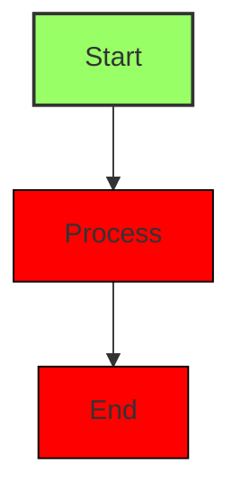

# Mermaid classDef/class Node Styling

## Overview

Implemented parsing and rendering of `classDef` style definitions and `class` assignments for Mermaid flowchart nodes. This allows users to customize node appearance (fill color, stroke color, stroke width) using standard Mermaid syntax.

## Key Files

- `src/markdown/mermaid/flowchart.rs` - Parser and renderer with classDef/class support

## Implementation Details

### NodeStyle Struct

New struct to hold custom style properties:

```rust
pub struct NodeStyle {
    pub fill: Option<Color32>,
    pub stroke: Option<Color32>,
    pub stroke_width: Option<f32>,
}
```

### Flowchart Struct Extensions

Two new fields added to store parsed styles:

```rust
pub struct Flowchart {
    // ... existing fields ...
    pub class_defs: HashMap<String, NodeStyle>,   // class_name -> style
    pub node_classes: HashMap<String, String>,    // node_id -> class_name
}
```

### Parsing Functions

| Function | Purpose |
|----------|---------|
| `parse_class_def()` | Parses `classDef className fill:#hex,stroke:#hex,stroke-width:Npx` |
| `parse_class_assignment()` | Parses `class nodeId1,nodeId2 className` |
| `parse_css_color()` | Parses hex colors (#RGB, #RRGGBB, #RRGGBBAA) |
| `parse_stroke_width()` | Parses stroke-width with optional "px" suffix |

### Color Parsing

Supports standard CSS hex color formats:
- 3-char shorthand: `#9f6` → `#99ff66` (each digit multiplied by 17)
- 6-char standard: `#99ff66`
- 8-char with alpha: `#99ff66dd`

### Rendering Integration

Modified `draw_node()` to accept optional `NodeStyle`:
1. Look up node's class assignment
2. Get corresponding `NodeStyle` from class definitions
3. Use custom colors if defined, otherwise fall back to `FlowchartColors` defaults

## Usage Example



## Supported Syntax

### classDef directive
```
classDef className fill:#hex,stroke:#hex,stroke-width:Npx
```

Properties (all optional):
- `fill` - Background color (hex)
- `stroke` - Border color (hex)
- `stroke-width` - Border width (with or without "px")

### class directive
```
class nodeId className           # Single node
class nodeId1,nodeId2 className  # Multiple nodes
```

## Edge Cases Handled

- Undefined class references: Uses default colors gracefully
- Partial styles: Only specified properties override defaults
- Invalid hex colors: Silently ignored, uses defaults
- Missing properties: Other properties still apply

## Tests Added

10 new tests in `mod.rs`:
- `test_classdef_basic` - Basic parsing and rendering
- `test_classdef_multiple_classes` - Multiple class definitions
- `test_classdef_hex_color_formats` - 6-char and 8-char hex
- `test_classdef_short_hex` - 3-char shorthand hex
- `test_classdef_stroke_width_formats` - With/without "px"
- `test_classdef_undefined_class_reference` - Graceful handling
- `test_classdef_with_semicolons` - Semicolon compatibility
- `test_class_assignment_multiple_nodes` - Comma-separated nodes
- `test_classdef_partial_style` - Partial style definitions

## Note on Alpha Colors

When using `#RRGGBBAA` format, be aware that egui's `Color32` uses premultiplied alpha internally. RGB values may appear different when accessed via `.r()`, `.g()`, `.b()` methods for colors with alpha < 255. The alpha value itself is preserved correctly.
