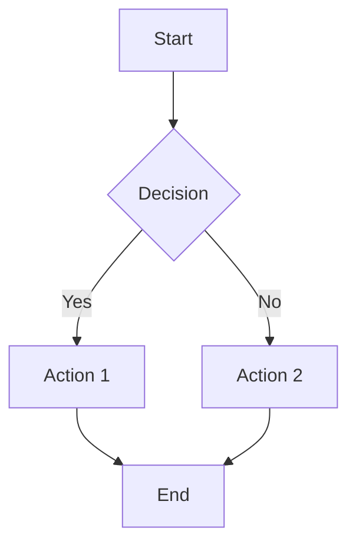
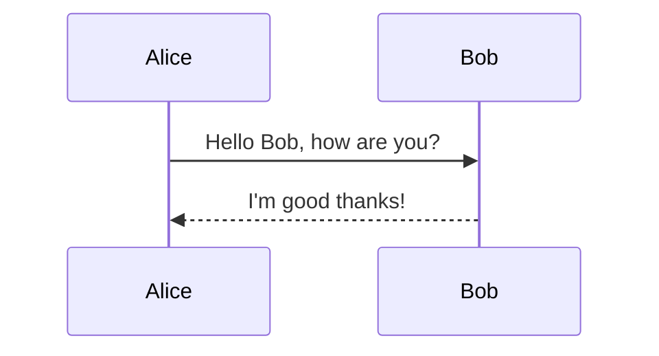
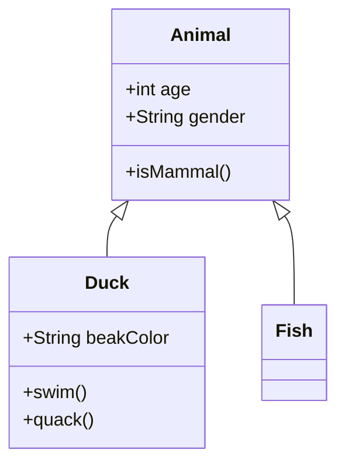

# MermaidJS Diagram Rendering

## Overview

Ferrite supports MermaidJS diagram blocks with **native diagram rendering**. When you create a fenced code block with the `mermaid` language tag, Ferrite parses and renders the diagram visualization inline using egui's native drawing primitives.

## Features

### Native Diagram Rendering

Ferrite renders mermaid diagrams natively without any external dependencies:
- **Zero network requirements** - Works completely offline
- **Real-time rendering** - Diagrams update as you type (great for split view!)
- **Theme integration** - Diagrams automatically adapt to light/dark mode
- **Fast performance** - No API calls, pure Rust rendering

### Automatic Diagram Type Detection

Ferrite automatically detects the type of Mermaid diagram from the source code and displays an appropriate icon and label. Supported diagram types include:

| Type | Keyword | Icon |
|------|---------|------|
| Flowchart | `flowchart`, `graph` | 📊 |
| Sequence | `sequenceDiagram` | ↔️ |
| Class | `classDiagram` | 🏗️ |
| State | `stateDiagram` | 🔄 |
| Entity-Relationship | `erDiagram` | 🔗 |
| User Journey | `journey` | 🚶 |
| Gantt | `gantt` | 📅 |
| Pie | `pie` | 🥧 |
| Git Graph | `gitGraph` | 🌳 |
| Mindmap | `mindmap` | 🧠 |
| Timeline | `timeline` | ⏳ |
| And more... | | |

### Visual Distinction

Mermaid blocks are visually distinct from regular code blocks:
- **Blue-tinted background** - Helps identify diagram blocks at a glance
- **Header bar** - Shows diagram type icon, name, and "mermaid" badge
- **Collapsible source** - Toggle source view to see the raw mermaid code
- **Syntax highlighting** - Source code is syntax-highlighted for readability

### Theme Support

The mermaid widget automatically adapts to light and dark themes:
- Colors adjust based on the current theme setting
- Maintains proper contrast and readability in both modes

## Usage

### Basic Example

```markdown

```

### Sequence Diagram Example

```markdown

```

### Class Diagram Example

```markdown

```

## Implementation Details

### Architecture

The mermaid rendering system consists of:

1. **`MermaidDiagramType` enum** (`src/markdown/widgets.rs`)
   - Enumerates all supported diagram types
   - Provides display names and icons for each type

2. **`detect_mermaid_diagram_type()` function** (`src/markdown/widgets.rs`)
   - Parses the first non-comment line of mermaid source
   - Returns the appropriate `MermaidDiagramType`

3. **`MermaidBlockData` struct** (`src/markdown/widgets.rs`)
   - Holds mermaid source code and metadata
   - Tracks diagram type and modification state
   - Manages cached rendering state (for future SVG support)

4. **`MermaidBlock` widget** (`src/markdown/widgets.rs`)
   - egui widget for rendering mermaid blocks
   - Displays header with diagram type info
   - Shows syntax-highlighted source code
   - Supports dark/light theme styling

5. **`render_mermaid_block()` function** (`src/markdown/editor.rs`)
   - Integration point in the rendered markdown editor
   - Routes mermaid code blocks to the specialized widget

### Code Flow

```
Markdown Source → Parser → CodeBlock AST Node
                              ↓
                    language == "mermaid"?
                    /                    \
                 Yes                      No
                  ↓                        ↓
          render_mermaid_block()    render_code_block()
                  ↓                        ↓
           MermaidBlock              EditableCodeBlock
```

## Supported Diagram Types

### Fully Implemented ✅

- **Flowcharts** (`flowchart TD`, `flowchart LR`, `graph TD`, etc.)
  - All directions: TD (top-down), BT (bottom-up), LR (left-right), RL (right-left)
  - Node shapes: Rectangle, RoundRect, Diamond, Circle, Stadium, Hexagon, Cylinder, Subroutine
  - Edge styles: Solid, Dotted, Thick
  - Edge arrows: Arrow, Circle, Cross, Bidirectional
  - Edge labels

- **Sequence Diagrams** (`sequenceDiagram`)
  - Participants and actors
  - Synchronous and asynchronous messages
  - Response messages (dashed arrows)
  - Lifelines

- **Pie Charts** (`pie`)
  - Title support
  - Automatic slice coloring
  - Legend with values

- **State Diagrams** (`stateDiagram-v2`)
  - States with labels
  - Transitions with labels
  - Start and end states (`[*]`)
  - Topological layout

- **Mindmaps** (`mindmap`)
  - Hierarchical node layout
  - Indentation-based parsing
  - Color-coded levels
  - Connecting lines

- **Class Diagrams** (`classDiagram`)
  - Classes with attributes and methods
  - Visibility modifiers (+, -, #, ~)
  - Stereotypes (<<interface>>, <<abstract>>)
  - Relationships: Inheritance, Composition, Aggregation, Association, Dependency, Realization
  - Relationship arrows and decorations

- **Entity-Relationship Diagrams** (`erDiagram`)
  - Entities with attributes
  - Primary key (PK) and Foreign key (FK) markers
  - Cardinality notation: ||, |o, }|, }o (exactly one, zero or one, one or more, zero or more)
  - Identifying and non-identifying relationships
  - Relationship labels

- **Git Graphs** (`gitGraph`)
  - Commits with IDs and messages
  - Branch creation and checkout
  - Merge commits with visual connections
  - Color-coded branches
  - Branch labels

- **Gantt Charts** (`gantt`)
  - Task bars with durations
  - Section groupings
  - Task dependencies (after syntax)
  - Milestones (diamond markers)
  - Task states: done (✓), active, critical (highlighted)
  - Day-based timeline with grid

- **Timelines** (`timeline`)
  - Title support
  - Period markers on horizontal timeline
  - Multiple events per period
  - Color-coded periods
  - Section-based organization

- **User Journeys** (`journey`)
  - Title support
  - Section groupings (journey phases)
  - Task cards with satisfaction scores (1-5)
  - Emoji face indicators (😫 to 😊)
  - Score-based vertical positioning (higher score = higher position)
  - Actor labels
  - Connected path visualization

### All Diagram Types Complete! ✅

All major MermaidJS diagram types are now supported with native rendering!

## Current Limitations

### Layout Simplification

The native renderer uses a simplified layout algorithm compared to MermaidJS:
- Complex graphs may look different from the official mermaid renderer
- Very large diagrams may need manual adjustment

### Subset of Mermaid Syntax

Not all mermaid syntax features are supported yet:
- Subgraphs (in progress)
- Styling directives
- Click events

## Future Enhancements

1. **Advanced Features**
   - Subgraphs for flowcharts
   - Notes and comments in sequence diagrams
   - Composite states in state diagrams

3. **Edit-in-Rendered Mode**
   - Allow editing mermaid source directly in rendered mode

4. **Export Options**
   - Export diagrams to SVG/PNG
   - Copy diagram to clipboard

## Testing

The mermaid implementation includes comprehensive tests:

```bash
# Run mermaid-specific tests
cargo test mermaid
```

### Test Coverage

- Diagram type detection for all supported types
- Edge cases (comments, empty source, unknown types)
- Data structure operations (creation, modification, serialization)
- Output field validation

## Related Tasks

- **Task 83**: Initial MermaidJS diagram rendering implementation
- **Task 79**: Split View (dependency - diagrams work in split view)
- **Tasks 64-67**: List editing fixes (diagrams don't interfere with lists)

## Implementation Architecture

```
Mermaid Source → Parser → AST → Layout Engine → egui Renderer
```

### Parser (`parse_flowchart`)
- Parses mermaid syntax line by line
- Extracts nodes, edges, labels
- Detects node shapes from bracket patterns
- Handles edge labels and styles

### Layout Engine (`layout_flowchart`)  
- Assigns nodes to layers using topological sort
- Centers each layer horizontally/vertically
- Handles all four directions (TD, BT, LR, RL)
- Calculates node positions and total size

### Renderer (`render_flowchart`)
- Uses egui's Painter API for all drawing
- Draws nodes with proper shapes (rect, diamond, circle, etc.)
- Draws edges with arrows and optional labels
- Adapts colors based on theme

## Files Changed

| File | Changes |
|------|---------|
| `src/markdown/mermaid.rs` | **NEW**: Native parser, layout engine, and renderer |
| `src/markdown/widgets.rs` | MermaidDiagramType, MermaidBlockData, MermaidBlock widget |
| `src/markdown/editor.rs` | render_mermaid_block(), detect mermaid in code blocks |
| `src/markdown/mod.rs` | Added mermaid module export |
| `docs/technical/mermaid-diagrams.md` | This documentation |
| `docs/example-mermaid.md` | Example file with various diagram types |
