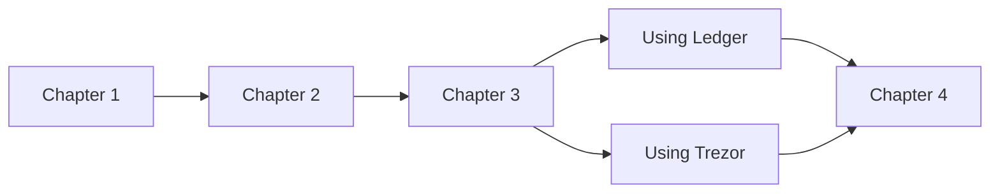
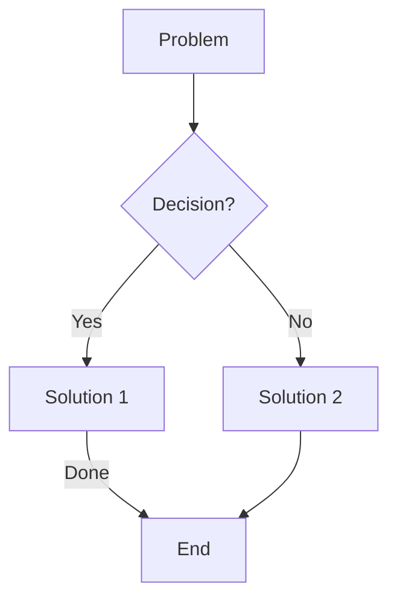

# Mermaid Edge Parsing

## Overview

Fixed critical bugs in mermaid flowchart edge parsing that caused chained edges to fail parsing and display raw syntax as node text instead of creating proper graph connections.

## Key Files

- `src/markdown/mermaid.rs` - Main mermaid parser (lines 530-800 for edge parsing)

## Problem

The original parser only handled single edges per line. Chained edge definitions like:

```mermaid
a[Chapter 1] --> b[Chapter 2] --> c[Chapter 3]
```

Would fail because after finding the first `-->`, the parser tried to treat `b[Chapter 2] --> c[Chapter 3]` as a single node, which failed.

## Solution

### 1. Arrow Pattern Ordering

Created `ARROW_PATTERNS` constant with patterns sorted longest-first to prevent shorter patterns from incorrectly matching:

```rust
const ARROW_PATTERNS: &[(&str, EdgeStyle, ArrowHead, ArrowHead)] = &[
    // 4+ char patterns first
    ("<-->", EdgeStyle::Solid, ArrowHead::Arrow, ArrowHead::Arrow),
    ("o--o", EdgeStyle::Solid, ArrowHead::Circle, ArrowHead::Circle),
    ("--->", EdgeStyle::Solid, ArrowHead::None, ArrowHead::Arrow),
    ("-.->", EdgeStyle::Dotted, ArrowHead::None, ArrowHead::Arrow),
    // 3 char patterns after
    ("-->", EdgeStyle::Solid, ArrowHead::None, ArrowHead::Arrow),
    // ...
];
```

### 2. Arrow Pattern Finder

Added `find_arrow_pattern()` helper that finds the best-matching (earliest position, longest pattern) arrow in text.

### 3. Edge Label Parser

Added `parse_edge_label()` helper to extract `|label|` syntax after arrows:

```rust
fn parse_edge_label(text: &str) -> (Option<String>, &str) {
    if text.starts_with('|') {
        if let Some(end_pos) = text[1..].find('|') {
            // Extract label and return remaining text
        }
    }
    (None, text)
}
```

### 4. Full Chain Parser

Created `parse_edge_line_full()` that iterates through a line, parsing each node-arrow-node segment and collecting all nodes and edges:

```rust
fn parse_edge_line_full(line: &str) -> Option<(Vec<(String, String, NodeShape)>, Vec<FlowEdge>)>
```

Key logic:
1. Find first arrow in remaining text
2. Parse source node (before arrow)
3. Extract label if present (after arrow)
4. Find target node (before next arrow or end of line)
5. Create edge from source to target
6. Continue with target as potential next source

## Tests Added

- `test_parse_edge_with_label` - Single edge with label
- `test_parse_chained_edges` - Three-node chain `A --> B --> C`
- `test_parse_chained_edges_with_labels` - Chain with labels on each edge
- `test_parse_flowchart_with_chained_edges` - Full flowchart with LR direction
- `test_parse_decision_tree_with_chained_edges` - Complex decision tree with diamonds and labels

## Usage

The parser now correctly handles:





## Related Tasks

- Task 42: Fix edge parsing (this task) ✅
- Task 45: Refactor mermaid.rs into modules (next)
- Task 43: Fix layout direction (depends on 45)
- Task 44: Fix missing nodes and branching (depends on 43)
