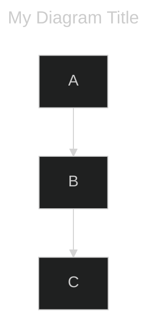
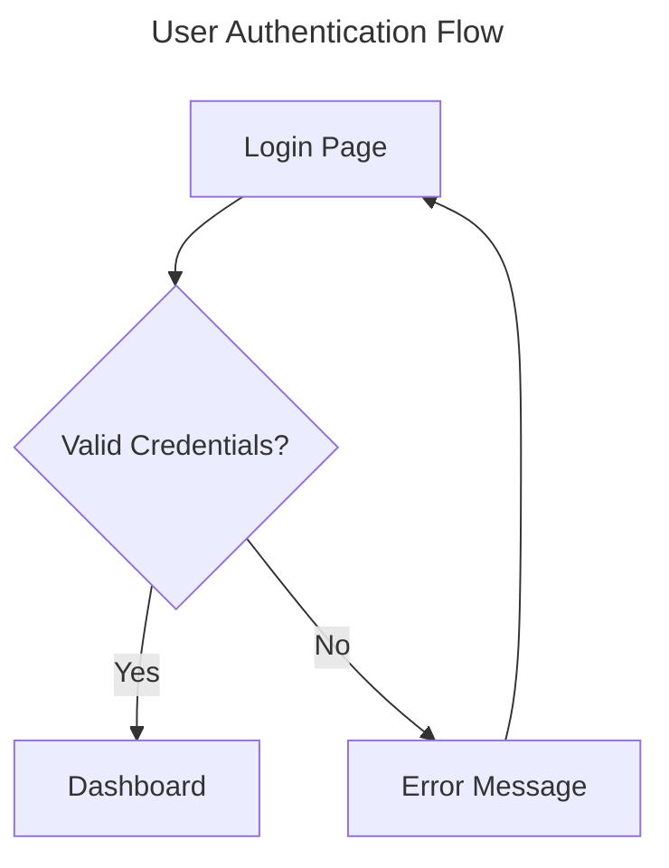
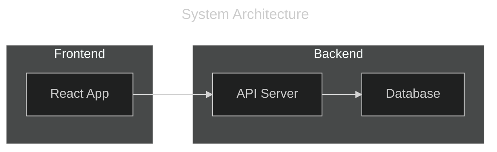

# Mermaid YAML Frontmatter Support

**Status:** Implemented  
**Version:** v0.2.5

## Overview

Ferrite now supports YAML frontmatter in Mermaid diagrams, allowing users to specify diagram titles and configuration options. This follows the [Mermaid.js frontmatter specification](https://mermaid.js.org/config/frontmatter.html).

## Syntax

Frontmatter is specified between `---` markers at the start of a Mermaid code block:

## Supported Features

### Title Display

When a `title` is specified in the frontmatter, Ferrite displays it above the diagram:

- **Font size:** 1.3x the diagram font size
- **Style:** Bold
- **Color:** Adapts to dark/light mode
- **Position:** Centered above the diagram

### Configuration Parsing

The `config` section is parsed and stored, with the following fields recognized:

- `theme`: Theme name (e.g., "dark", "default", "forest", "neutral")

**Note:** Theme application is not yet implemented. The `config.theme` value is parsed but does not currently affect diagram rendering. This is reserved for future enhancement.

## Implementation Details

### Parsing Logic

1. Check if source starts with `---`
2. Find the closing `---` delimiter
3. Extract YAML content between delimiters
4. Parse YAML using `serde_yaml`
5. Return (frontmatter, remaining_diagram_source)

### Graceful Error Handling

- **No frontmatter:** Source passed through unchanged
- **Invalid YAML:** Frontmatter ignored, diagram renders normally
- **Unknown keys:** Silently ignored (forward compatibility)
- **Empty frontmatter:** Parsed successfully, no title displayed

### Files Modified

| File | Change |
|------|--------|
| `src/markdown/mermaid/frontmatter.rs` | New module - frontmatter parsing |
| `src/markdown/mermaid/mod.rs` | Integration with render pipeline |

## Test Cases

See `test_md/test_flowcharts.md` for visual test cases:

- YAML Frontmatter with Title
- YAML Frontmatter with Config
- Frontmatter with Unknown Keys
- Empty Frontmatter

Unit tests in `frontmatter.rs`:

- `test_no_frontmatter` - Source without frontmatter
- `test_simple_frontmatter_with_title` - Basic title extraction
- `test_frontmatter_with_config` - Title + config parsing
- `test_frontmatter_title_only` - Title without config
- `test_frontmatter_config_only` - Config without title
- `test_invalid_yaml_frontmatter` - Graceful error handling
- `test_no_closing_delimiter` - Missing closing `---`
- `test_empty_frontmatter` - Empty YAML between delimiters
- `test_frontmatter_with_unknown_keys` - Forward compatibility
- `test_frontmatter_with_quoted_title` - YAML quoted strings
- `test_frontmatter_windows_line_endings` - Cross-platform support

## Example Usage

### Simple Title

### With Configuration

## Future Enhancements

1. **Theme application:** Apply `config.theme` to affect diagram colors
2. **Additional config options:** Support more Mermaid configuration options as needed
3. **Per-diagram styling:** Allow custom styling via frontmatter
