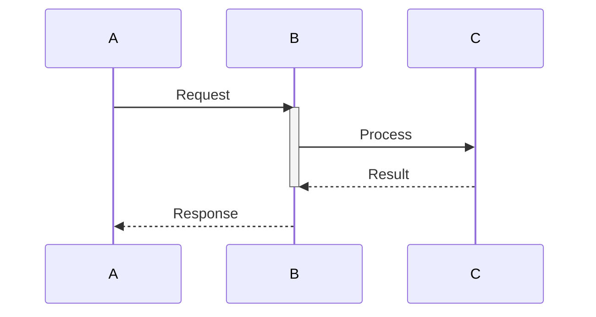
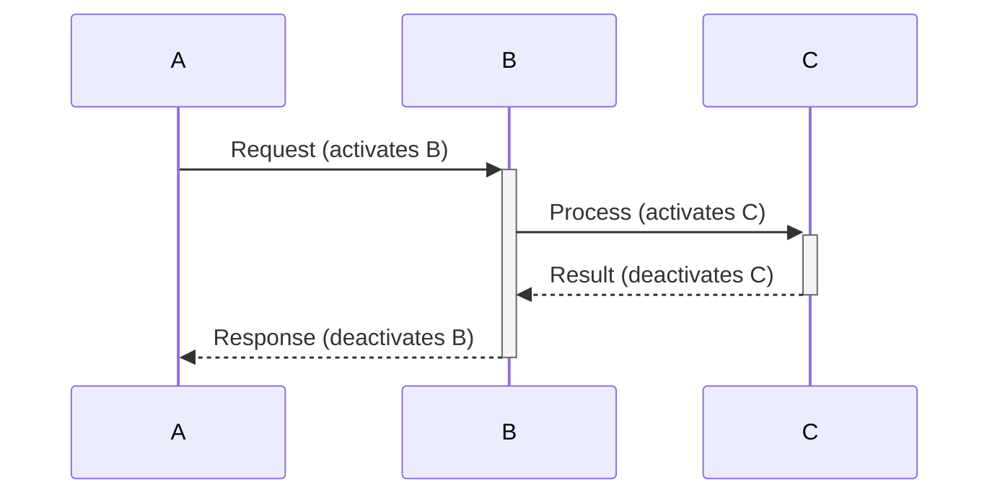
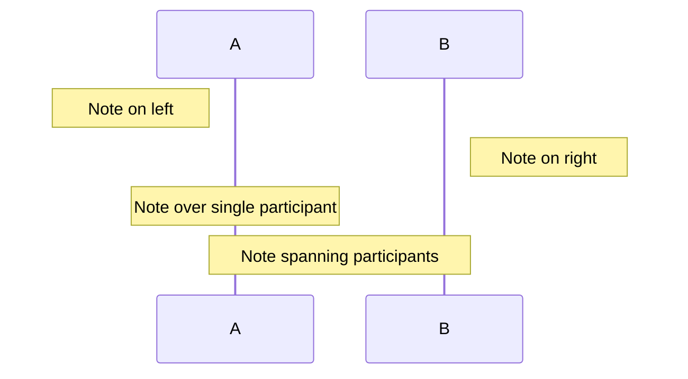
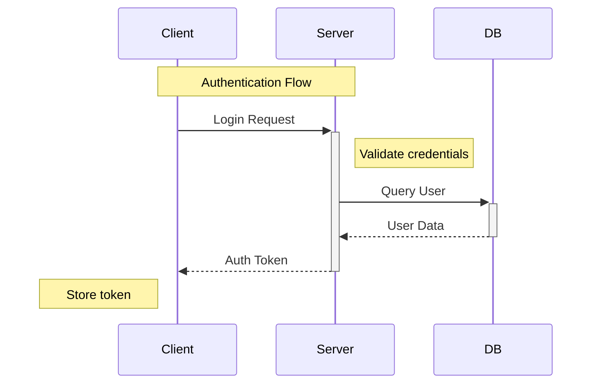

# Sequence Diagram Activation Boxes and Notes

This document describes the activation box and note support implemented in Task 19 for Ferrite's Mermaid sequence diagram rendering.

## Overview

This feature adds two important elements to sequence diagrams:

1. **Activation Boxes**: Rectangles on participant lifelines showing when a participant is actively processing
2. **Notes**: Annotation boxes positioned left, right, or over participants

## Syntax Support

### Activation Syntax

#### Explicit Activation


#### Shorthand Activation (`+`/`-`)


### Note Syntax



## Implementation Details

### AST Types

```rust
/// A message with activation support
pub struct Message {
    pub from: String,
    pub to: String,
    pub label: String,
    pub message_type: MessageType,
    pub activate_target: bool,    // Activate target on send
    pub deactivate_target: bool,  // Deactivate target on send
}

/// Position for a note
pub enum NotePosition {
    LeftOf(String),
    RightOf(String),
    Over(Vec<String>),
}

/// A note in a sequence diagram
pub struct SeqNote {
    pub position: NotePosition,
    pub text: String,
}

/// Statement types (extended)
pub enum SeqStatement {
    Message(Message),
    Block(SeqBlock),
    Note(SeqNote),
    Activate(String),
    Deactivate(String),
}
```

### Activation State Tracking

Activations are tracked using a stack-based approach to support nesting:

```rust
struct ActivationState {
    start_ys: Vec<f32>,  // Stack of activation start Y coordinates
    depth: usize,        // Nesting depth for horizontal offset
}
```

When a participant is activated:
1. Push the current Y position onto the stack
2. Increment depth

When a participant is deactivated:
1. Pop the start Y from the stack
2. Draw the activation box from start_y to current_y
3. Decrement depth

Nested activations are drawn with a horizontal offset to show stacking.

### Parser Changes

The parser now recognizes:

| Syntax | Meaning |
|--------|---------|
| `activate X` | Start activation on participant X |
| `deactivate X` | End activation on participant X |
| `A->>+B: msg` | Message that activates B |
| `B-->>-A: resp` | Message that deactivates B |
| `Note left of X: text` | Note to the left of X |
| `Note right of X: text` | Note to the right of X |
| `Note over X: text` | Note centered over X |
| `Note over X,Y: text` | Note spanning X to Y |

## Rendering

### Activation Boxes

- Drawn as filled rectangles on the lifeline
- Width: 10px (configurable via `activation_width`)
- Nested activations offset by 4px (`activation_offset`)
- Unclosed activations extend to end of diagram

### Notes

- Drawn with a dog-ear corner (folded top-right)
- Positioned based on `NotePosition`:
  - `LeftOf`: To the left of participant, with spacing
  - `RightOf`: To the right of participant, with spacing
  - `Over`: Centered over participant(s)
- Note width: 100px default, expands for multi-participant spans

### Colors

| Element | Dark Theme | Light Theme |
|---------|------------|-------------|
| Activation fill | rgb(70, 90, 110) | rgb(200, 220, 240) |
| Activation stroke | rgb(100, 140, 180) | rgb(100, 140, 180) |
| Note fill | rgb(80, 80, 60) | rgb(255, 255, 220) |
| Note stroke | rgb(140, 140, 100) | rgb(180, 180, 140) |
| Note text | rgb(220, 220, 200) | rgb(60, 60, 40) |

## Layout Constants

| Parameter | Default | Description |
|-----------|---------|-------------|
| `activation_width` | 10.0 | Width of activation box |
| `activation_offset` | 4.0 | Horizontal offset for nested activations |
| `note_width` | 100.0 | Default width for notes |
| `note_padding` | 8.0 | Padding inside notes |
| `note_corner_size` | 8.0 | Size of dog-ear corner |

## Limitations

1. Multi-line notes are not wrapped (single line display)
2. Note positioning doesn't account for collision with messages
3. Activation boxes don't interact with control-flow blocks visually

## Examples

### Combined Example


## Files

- **Implementation**: `src/markdown/mermaid.rs`
- **Key types**: `SeqNote`, `NotePosition`, `ActivationState`
- **Key functions**: `parse_sequence_note()`, `draw_note()`, `draw_activation_box()`
