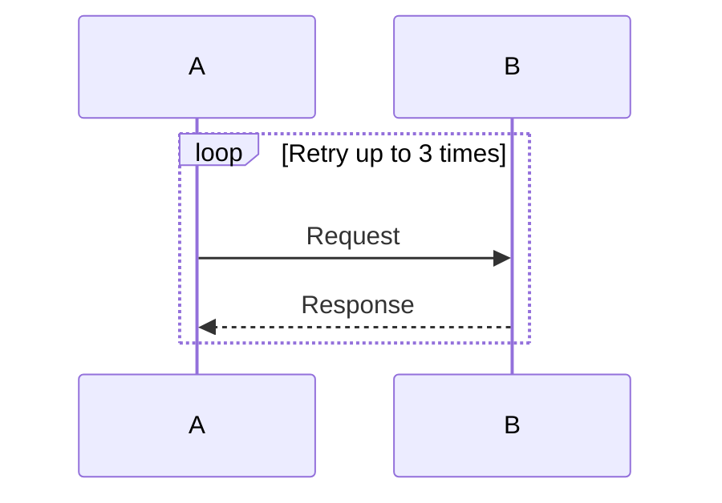
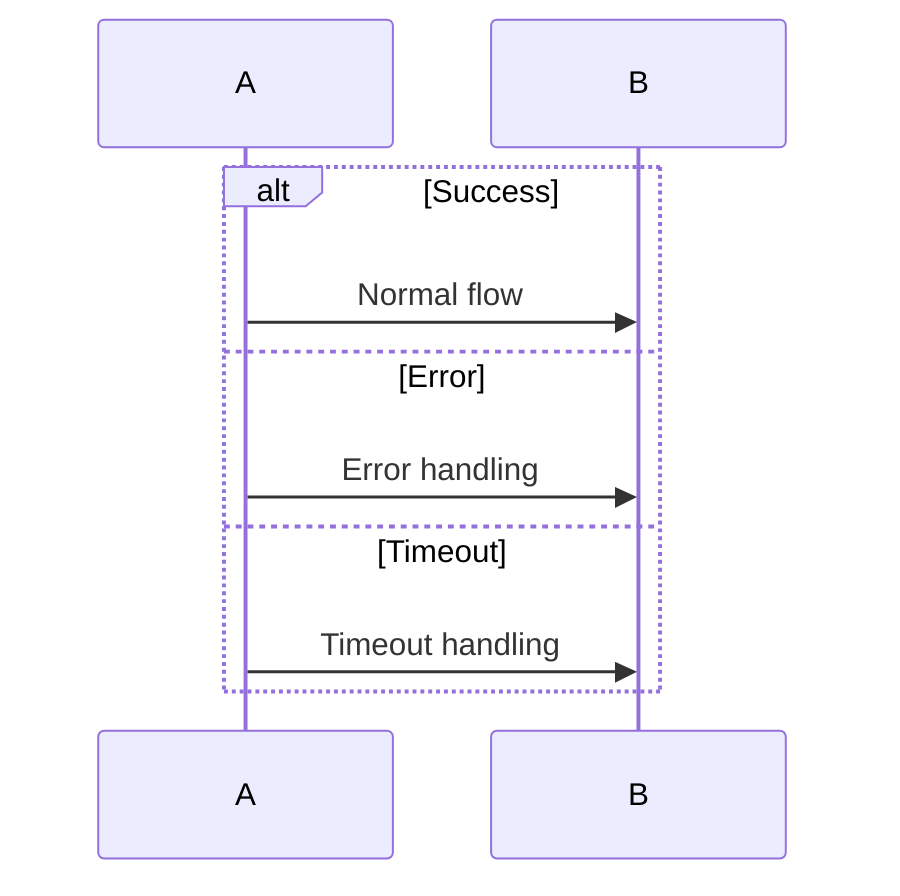
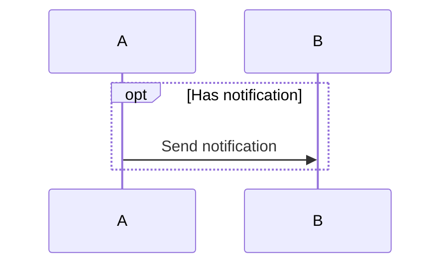
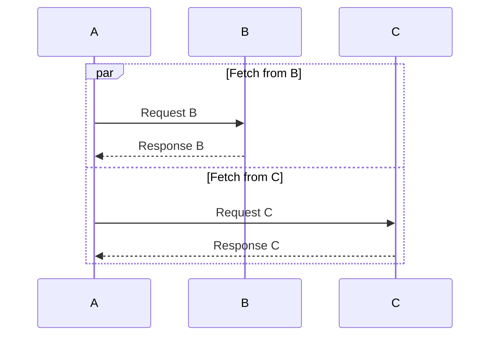

# Sequence Diagram Control-Flow Blocks

## Overview

Task 17 implements control-flow blocks (`loop`, `alt`, `opt`, `par`) for sequence diagrams in Ferrite's native Mermaid renderer.

## Supported Syntax

### Loop Block
Repeating sequence of messages.



### Alt Block (Conditional)
Alternative paths with conditions. Supports multiple `else` branches.



### Opt Block (Optional)
Optional sequence that may or may not occur.



### Par Block (Parallel)
Parallel execution paths. Supports multiple `and` branches.



## Implementation Details

### AST Model

```rust
/// Type of control-flow block
pub enum SeqBlockKind {
    Loop,
    Alt,
    Opt,
    Par,
}

/// A segment within a block (for alt/par branches)
pub struct SeqBlockSegment {
    pub segment_label: Option<String>,
    pub statements: Vec<SeqStatement>,
}

/// A control-flow block
pub struct SeqBlock {
    pub kind: SeqBlockKind,
    pub label: String,
    pub segments: Vec<SeqBlockSegment>,
}

/// Statement in a sequence diagram
pub enum SeqStatement {
    Message(Message),
    Block(SeqBlock),
}
```

### Parser

The parser uses a block stack to handle nesting:

1. **Block openers** (`loop`, `alt`, `opt`, `par`): Push new `SeqBlockBuilder` onto stack
2. **Branch keywords** (`else`, `and`): Start new segment in current block (validates block kind)
3. **Block closer** (`end`): Pop and finalize block, add to parent or top-level
4. **Messages**: Add to current block or top-level

Error handling:
- Unmatched `end` without opener
- `else` outside `alt` block
- `and` outside `par` block
- Unclosed block at end of diagram

### Renderer

Blocks are rendered as labeled rectangles:

1. **Background**: Semi-transparent fill color per block type
2. **Header label**: Block kind + label in top-left corner (e.g., "loop [Retry]")
3. **Segment separators**: Dashed lines between alt/par branches with labels
4. **Nesting**: Inner blocks are inset from outer blocks

Block colors (with transparency for layering):
- Loop: Green tint
- Alt: Orange/amber tint
- Opt: Blue tint
- Par: Purple tint

### Layout Calculation

The renderer calculates block dimensions by:
1. Counting message slots in all segments recursively
2. Adding header height (20px)
3. Adding separator heights for multi-segment blocks
4. Adding padding (8px)

Horizontal span: From leftmost to rightmost participant, with padding.

## Files Modified

- `src/markdown/mermaid.rs`:
  - Lines ~1143-1205: New AST types (`SeqBlockKind`, `SeqBlockSegment`, `SeqBlock`, `SeqStatement`)
  - Lines ~1207-1280: `SeqBlockBuilder` helper struct
  - Lines ~1282-1405: Updated `parse_sequence_diagram()` with block parsing
  - Lines ~1445-1970: Updated renderer with block drawing functions

## Testing

Visual test file: `docs/test-sequence-blocks.md`

Test cases:
1. Simple blocks (loop, alt, opt, par)
2. Multi-branch blocks (alt with multiple else, par with multiple and)
3. Nested blocks (blocks inside blocks)
4. Mixed content (messages and blocks interleaved)
5. Empty blocks
6. Blocks without labels

Parser error cases:
- Unmatched `end`
- `else` outside `alt`
- `and` outside `par`
- Unclosed blocks

## Limitations

1. **No cross-block spanning**: Blocks cannot span across participants that don't have messages inside them
2. **Fixed colors**: Block colors are hardcoded, not themeable via Mermaid directives
3. **No critical blocks**: `critical` block type is not supported
4. **No break keyword**: `break` inside loops is not supported

## Future Enhancements

- Add `critical`, `break` block support
- Themeable block colors via Mermaid directives
- Activation boxes (Task 19)
- Notes (Task 19)
