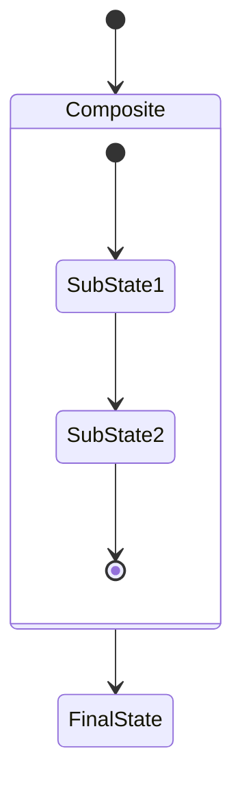
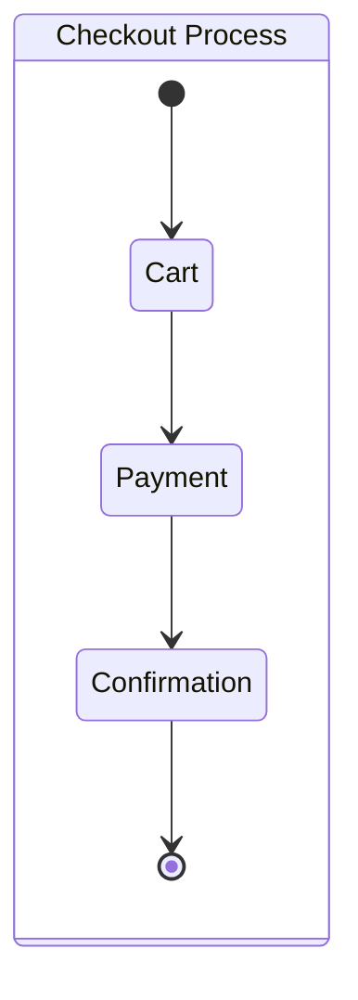
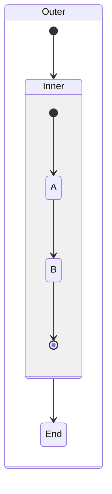

# Composite/Nested States in Ferrite State Diagrams

## Overview

Task 20 implemented support for composite (nested) states in Ferrite's native Mermaid state diagram renderer. This enables hierarchical state machines where states can contain child states with their own transitions.

## Syntax Support

### Basic Composite State



### Composite with Label



### Multi-Level Nesting



## AST Changes

### State Struct

Extended the `State` struct to support nesting:

```rust
pub struct State {
    pub id: String,
    pub label: String,
    pub is_start: bool,
    pub is_end: bool,
    /// Child states for composite states (empty for simple states)
    pub children: Vec<State>,
    /// Internal transitions within this composite state
    pub internal_transitions: Vec<Transition>,
    /// Parent state ID if this is a nested state
    pub parent: Option<String>,
}
```

### Helper Methods

- `is_composite()` - Check if state has children
- `all_states()` - Get all nested states recursively
- `find_state(id)` - Find a state by ID in the subtree
- `find_state_mut(id)` - Find mutable reference to a state

## Parser Implementation

### Recursive Block Parsing

The parser now uses `parse_state_diagram_block()` which handles:

1. **Composite detection**: Lines matching `state StateName {` or `state "Label" as StateName {`
2. **Recursive descent**: When `{` is encountered, recursively parse the block contents
3. **Block termination**: `}` returns control to parent context
4. **Parent tracking**: `parent_id` parameter propagates through recursion

### Key Parsing Logic

```rust
// Detect composite state opening
if line.starts_with("state ") && line.ends_with('{') {
    // Extract id and label
    // Create composite state
    // Recursively parse children
    parse_state_diagram_block(
        lines, idx,
        &mut composite.children,
        &mut composite.internal_transitions,
        Some(&state_id),
    )?;
}
```

## Layout Algorithm

### Bottom-Up Sizing

1. **Recurse first**: Layout children before computing parent bounds
2. **Aggregate sizes**: Composite size = child bounding box + padding + title bar
3. **Layer assignment**: Use topological sorting based on transitions at each level

### Layout Flow

```
layout_states(states, transitions, ...) {
    // 1. Recursively layout children of composites
    for state in composites:
        child_size = layout_states(state.children, ...)
        composite_sizes[state] = child_size + padding + title_bar

    // 2. Layer assignment (topological sort)
    assign_layers(states, transitions)

    // 3. Position states in layers
    for layer in layers:
        for state in layer:
            compute_position(state)
            if is_composite:
                reposition_children(offset)
}
```

### Repositioning Children

After computing composite positions, children are repositioned:

```rust
fn reposition_children(children, offset, layouts) {
    for child in children:
        layout.center += offset
        layout.bounds = Rect::from_center_size(...)
        reposition_children(child.children, offset, layouts)
}
```

## Rendering

### Visual Design

Composite states render as:

1. **Container**: Rounded rectangle with semi-transparent fill
2. **Title bar**: Darker background at top with state label
3. **Separator**: Horizontal line under title bar
4. **Content area**: Children rendered inside

### Draw Order

```
1. Draw composite containers (recursively)
2. Draw simple states (start/end circles, regular states)
3. Draw top-level transitions
4. Draw internal transitions (recursive)
```

### Colors

| Element | Dark Mode | Light Mode |
|---------|-----------|------------|
| Composite fill | rgba(40, 50, 65, 200) | rgba(235, 240, 250, 220) |
| Title bar | rgb(55, 70, 90) | rgb(220, 230, 245) |
| State fill | rgb(45, 55, 72) | rgb(240, 245, 250) |
| Stroke | rgb(100, 140, 180) | rgb(100, 140, 180) |

## Transition Handling

### Transition Types

1. **Top-level**: Between top-level states or into/out of composites
2. **Internal**: Within a composite (stored in `state.internal_transitions`)

### Cross-Level Transitions

Transitions can connect:
- Outer state → composite (enters default start state inside)
- Composite → outer state (exits from composite)
- State inside composite → outer state (crosses boundary)

## Layout Constants

```rust
let composite_padding = 20.0;    // Padding inside composite
let title_bar_height = 28.0;     // Height of title bar
let spacing_x = 100.0;           // Horizontal spacing between states
let spacing_y = 70.0;            // Vertical spacing between states
```

For nested levels, spacing is reduced:
- `spacing_x * 0.8`
- `spacing_y * 0.8`

## Advanced Transition Features (Task 21)

Task 21 extended the basic composite state support with:

### Transition Kind Classification

Each transition is now classified based on its hierarchy relationship:

```rust
pub enum TransitionKind {
    Internal,       // Same scope (same composite or both top-level)
    Enter,          // Entering a composite from outside
    Exit,           // Exiting a composite to outside
    CrossHierarchy, // Between different branches of hierarchy
}
```

### Transition Metadata

Enhanced `Transition` struct with scope information:

```rust
pub struct Transition {
    pub from: String,
    pub to: String,
    pub label: Option<String>,
    pub kind: TransitionKind,          // Computed during normalization
    pub source_scope: Option<String>,  // Enclosing composite (or None)
    pub target_scope: Option<String>,
    pub lca_scope: Option<String>,     // Lowest common ancestor
}
```

### Normalization Pass

After parsing, a normalization pass:
1. Builds ancestry map for all states
2. Computes `source_scope`, `target_scope`, `lca_scope` for each transition
3. Classifies each transition's `kind`

### Visual Distinction

Different transition kinds are rendered with different colors:
- **Internal**: Default arrow color
- **Enter/Exit**: Greenish tint (boundary crossing)
- **CrossHierarchy**: Pinkish tint (cross-branch)

### Improved Edge Routing

- **Smart anchor points**: Transitions connect to the nearest appropriate side of states
- **Header avoidance**: Anchors avoid the composite title bar area
- **Orthogonal routing**: Cross-hierarchy transitions optionally use orthogonal (elbow) paths

### Configuration Options

New `StateDiagramConfig` struct with customizable options:

```rust
pub struct StateDiagramConfig {
    pub composite_padding: f32,         // Default: 20.0
    pub header_height: f32,             // Default: 28.0
    pub child_spacing_x: f32,           // Default: 80.0
    pub child_spacing_y: f32,           // Default: 56.0
    pub min_state_width: f32,           // Default: 80.0
    pub state_height: f32,              // Default: 36.0
    pub spacing_x: f32,                 // Default: 100.0
    pub spacing_y: f32,                 // Default: 70.0
    pub margin: f32,                    // Default: 40.0
    pub orthogonal_cross_routing: bool, // Default: true
    pub prefer_horizontal_anchors: bool,// Default: true
}
```

## Testing Strategy

### Parser Tests

- Simple composite with transitions
- Multi-level nesting (3+ levels)
- Mixed flat and nested states
- Composite with labeled states

### Layout Tests

- Parent bounds contain all children + padding
- Title bar positioned correctly
- Children don't overlap

### Rendering Tests

- Composite containers render with correct z-order
- Internal transitions render correctly
- Transitions across levels connect properly

## Files Modified

- `src/markdown/mermaid.rs`: State struct, parser, renderer, transition normalization (~500 lines added/modified across Tasks 20 & 21)

## Related Tasks

- Task 16: Text measurement (dependency)
- Task 20: Composite/nested states (foundation)
- Task 21: Advanced nested state transitions (extensions)
