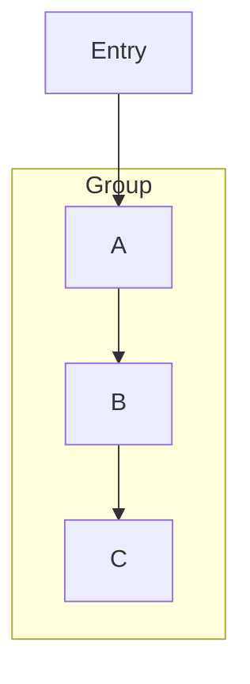

# Subgraph-Aware Layer Assignment in Flowchart Layout

## Overview

The Sugiyama layout algorithm for flowcharts now includes subgraph-aware layer assignment, which ensures that nodes belonging to the same subgraph are placed in consecutive layers. This keeps subgraph contents visually clustered together instead of being scattered across the diagram.

## Problem

Previously, the layer assignment phase of the Sugiyama algorithm processed all nodes globally without considering subgraph membership. This caused nodes that should be grouped together inside a subgraph to be assigned to non-consecutive layers, resulting in:

- Subgraph bounding boxes spanning large portions of the diagram
- Loss of visual grouping for related nodes
- Confusing layouts that didn't reflect the logical structure

## Solution

The implementation uses a two-phase approach:

### Phase 1: Standard Layer Assignment

The initial longest-path layer assignment runs as before, computing global layers for all nodes based on the directed graph structure.

### Phase 2: Subgraph Clustering

After the initial assignment, subgraph nodes are clustered:

1. **For each subgraph**, find all nodes that directly belong to it
2. **Compute relative layers** within the subgraph based only on internal edges
3. **Reassign layers** so all subgraph nodes occupy consecutive layers starting from the minimum layer in the group
4. **Propagate constraints** to ensure edge directions are maintained

## Implementation Details

### Data Structures

The `FlowGraph` struct was extended with:

```rust
/// Subgraph membership: node_index -> Option<subgraph_id>
node_subgraph: Vec<Option<String>>,

/// Subgraph info: subgraph_id -> (node_indices, child_subgraph_ids)
subgraph_info: HashMap<String, (Vec<usize>, Vec<String>)>,
```

### Key Functions

- `cluster_subgraph_layers()`: Main clustering logic, processes subgraphs from innermost to outermost
- `compute_subgraph_relative_layers()`: Computes layer order within a single subgraph
- `ensure_layer_constraints()`: Post-processing to maintain edge direction constraints

### Node-Subgraph Association

Nodes are associated with subgraphs during parsing. A node belongs to the **innermost** subgraph in which it is **first defined**. If a node is referenced outside a subgraph before being defined inside one, it won't be associated with that subgraph.

Example:


In this case, A, B, and C are associated with "Group" because they are first defined inside the subgraph block.

## Limitations

1. **First-definition association**: Nodes must be first defined inside a subgraph to be associated with it. This matches common Mermaid usage patterns.

2. **Non-nested clustering**: While nested subgraphs are supported, the clustering primarily optimizes for direct node membership. Complex nested structures may require additional refinement in future versions.

## Testing

Unit tests verify:

- Nodes in a subgraph are assigned consecutive layers
- External connections to/from subgraphs work correctly
- Multiple parallel subgraphs are handled properly
- Subgraph bounding boxes correctly encompass their nodes

## Related Files

- `src/markdown/mermaid/flowchart.rs` - Main implementation
- `src/markdown/mermaid/mod.rs` - Tests

## Related Tasks

- Task 49: Subgraph-aware layer assignment (this feature)
- Task 50: Subgraph internal layout (pending)
- Task 51: Subgraph visual styling (completed)
- Task 52: Edge routing for subgraphs (pending)
