# Flowchart Test Cases

## Coffee Machine Troubleshooting (TD)

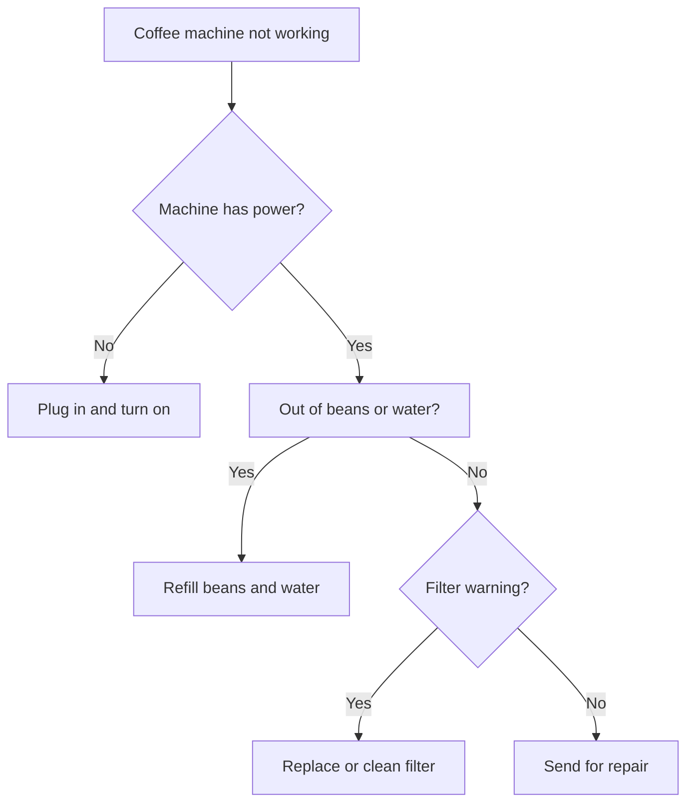

Expected:
- All 8 nodes should render (A, B, C, D, F, G, H, I)
- "No" branch from B should be on LEFT, "Yes" branch on RIGHT
- Hierarchy: A -> B -> (H, C) -> (G, D) -> (I, F)

## Chapter Flow (LR)

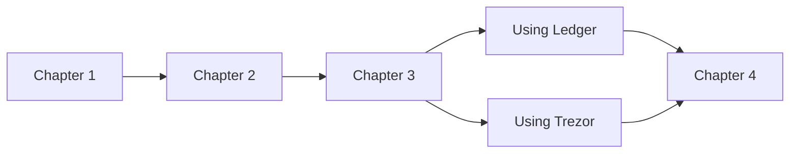

Expected:
- All 6 nodes should render (a, b, c, d, e, f)
- Flow goes left to right
- "Using Ledger" (d) should be ABOVE "Using Trezor" (e)

## Simple Decision (TD)

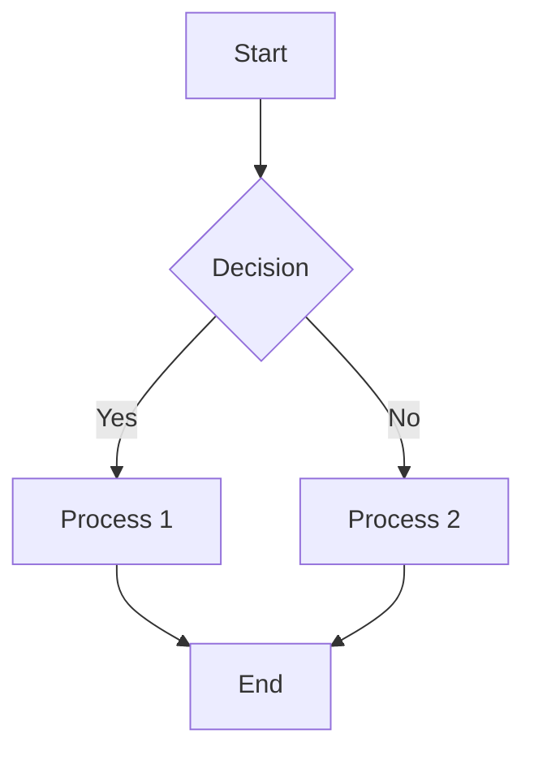

Expected:
- "Yes" (C) should be on LEFT
- "No" (D) should be on RIGHT

## Simple Decision (LR)

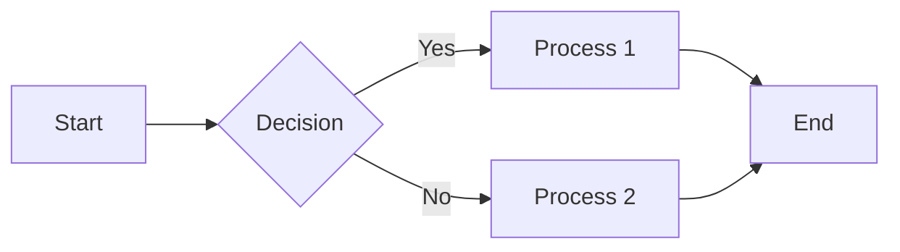

Expected:
- "Yes" (C) should be on TOP
- "No" (D) should be on BOTTOM

## Subgraph Test (TD)

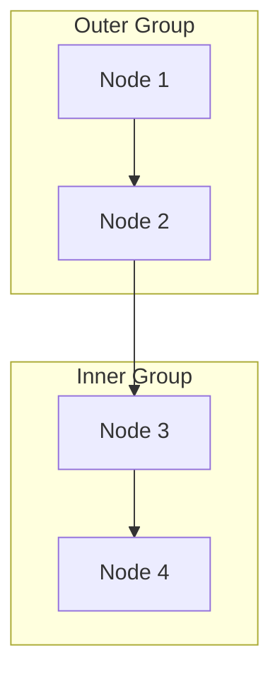

Expected:
- Two subgraph containers with visible cream/yellow backgrounds
- Titles "Outer Group" and "Inner Group" should be prominent
- Stroke should be clearly visible
- Different depth = alternating fill colors

## Nested Subgraph Test (Sibling Subgraphs)

```mermaid
flowchart TB
    subgraph one[First]
        direction LR
        x1[A] --> x2[B]
    end
    
    subgraph two[Second]  
        direction LR
        y1[C] --> y2[D]
    end
    
    one --> two
```

Expected:
- Two distinct subgraph containers
- Inside "First": A and B should be side-by-side (LR direction)
- Inside "Second": C and D should be side-by-side (LR direction)
- First should be above Second (TB main direction)
- Clear separation and visibility
- Warm cream/yellow background tones

## True Nested Subgraphs (Parent-Child)

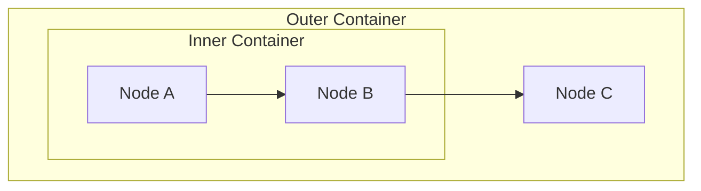

Expected:
- "Inner Container" should be fully inside "Outer Container"
- Node C should be below the Inner Container
- Edge from B to C should route properly
- Both titles should be visible and not overlap
- Inner should have different fill color (alternating depth)

## Deeply Nested Subgraphs (3 Levels)

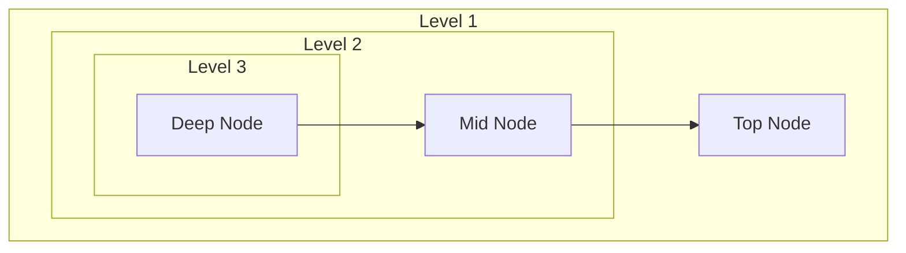

Expected:
- Three nested boxes (level1 > level2 > level3)
- Each level should have visible margins/padding
- All three titles should be visible
- Alternating fill colors for depth
- Edge routing through all levels

## Nested with Direction Override

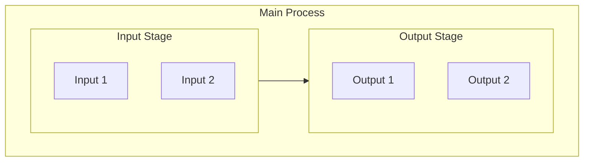

Expected:
- Main direction is TD (top to bottom)
- "Main Process" has direction LR override
- Input Stage should be LEFT of Output Stage (LR)
- Nodes within Input/Output should be arranged vertically (inherits LR)
- Both nested subgraphs visible with proper titles

## Edge Routing Across Subgraph Boundaries (TD)

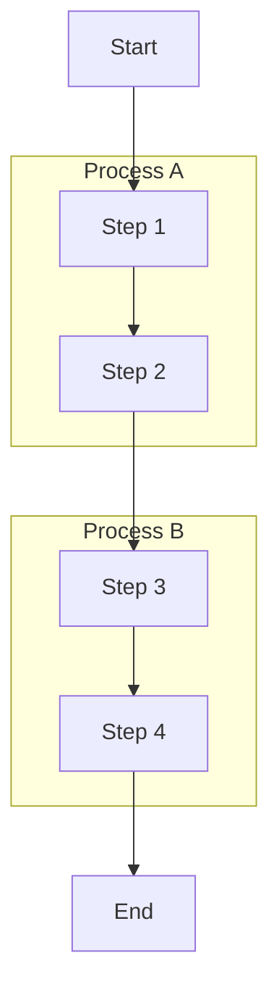

Expected:
- Edge from Start to A1 should enter subgraph A cleanly
- Edge from A2 to B1 should exit subgraph A and enter subgraph B cleanly
- Edge from B2 to End should exit subgraph B cleanly
- Edges should route through subgraph borders, not arbitrarily

## Edge Routing Across Subgraph Boundaries (LR)

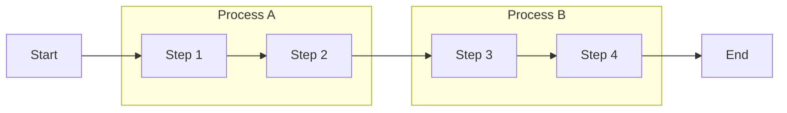

Expected:
- Same edge routing behavior but in left-to-right direction
- Edges should enter/exit subgraphs at left/right borders

## Complex Cross-Subgraph Routing

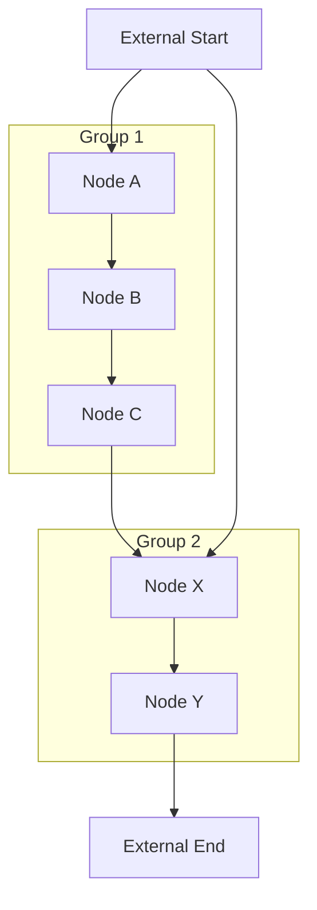

Expected:
- Multiple edges crossing subgraph boundaries
- Edge from External1 to Inner1 enters Group1
- Edge from Inner3 to Other1 exits Group1 and enters Group2
- Edge from External1 to Other1 enters Group2
- All edges should route cleanly through borders

## Asymmetric Shape Test

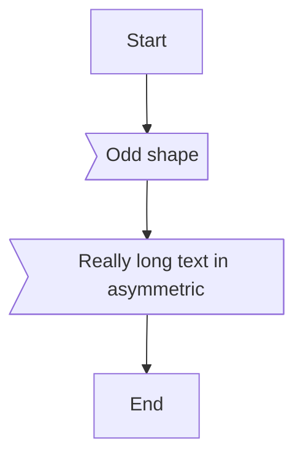

Expected:
- `B` node should render as left-pointing flag/banner shape
- `C` node should size appropriately for longer text
- Shape should have pointed left side, flat right side
- Text should be readable and visually centered

## Asymmetric Shape with Dash-Style Edge Labels

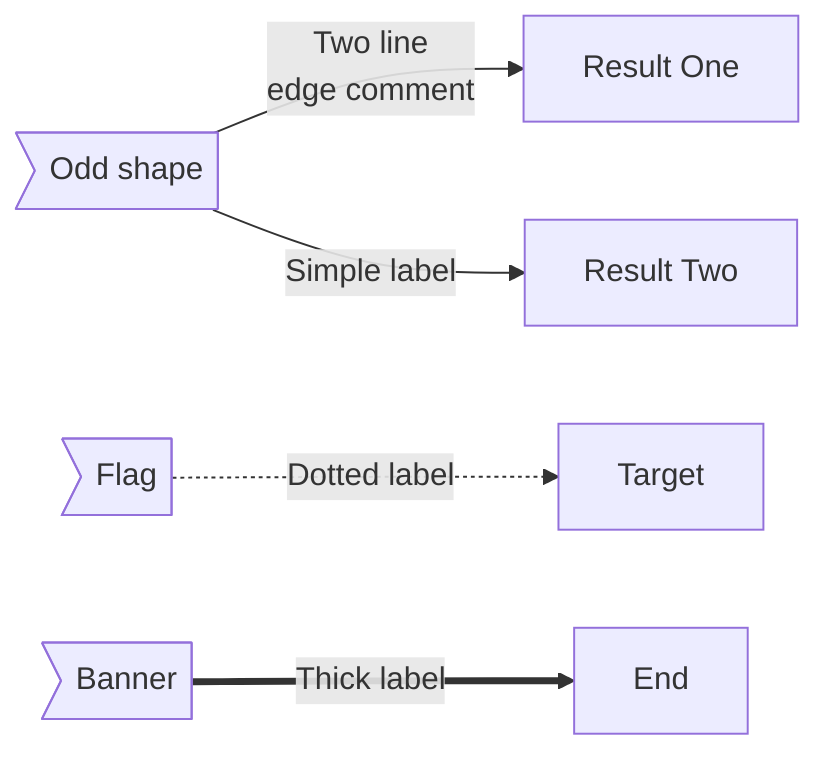

Expected:
- `od` node should render as left-pointing flag/banner (asymmetric), NOT as rectangle
- Edge from `od` to `ro` should have label "Two line\nedge comment" (with line break)
- Edge from `od` to `ro2` should have label "Simple label"
- `A` node should render as asymmetric shape with dotted edge to `B`
- `X` node should render as asymmetric shape with thick edge to `Y`
- All asymmetric nodes should have pointed left side, flat right side

## Standalone Asymmetric Nodes

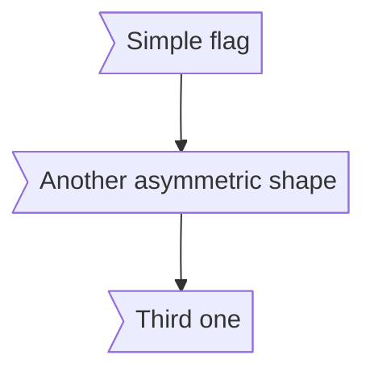

Expected:
- All three nodes (a, b, c) should render as flag/banner shapes
- Vertical layout with edges connecting them

## All Node Shapes

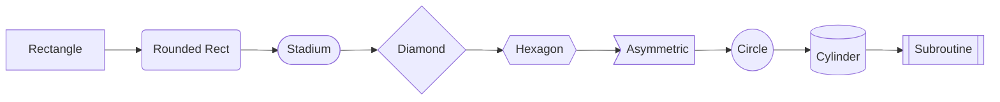

Expected:
- All 9 node shapes should render distinctly
- Each shape should match its Mermaid specification

## linkStyle Edge Styling

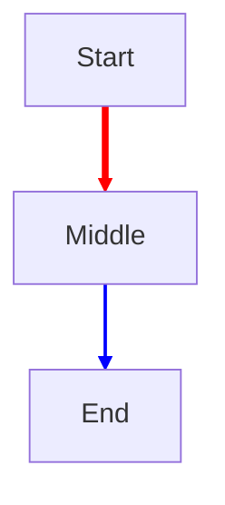

Expected:
- First edge (A→B) should be RED with 4px width
- Second edge (B→C) should be BLUE with 2px width

## linkStyle Default

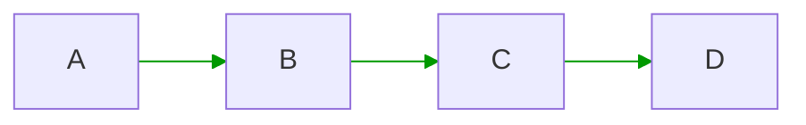

Expected:
- All three edges should render in GREEN (#090)

## linkStyle Mixed Index and Default

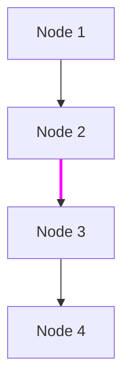

Expected:
- First edge (A→B): GRAY default (#333), 1px width
- Second edge (B→C): MAGENTA (#f0f), 3px width (override)
- Third edge (C→D): GRAY default (#333), 1px width

## linkStyle with Invalid Index

```mermaid
flowchart TD
    A --> B --> C
    linkStyle 99 stroke:#f00
```

Expected:
- All edges render with default style (invalid index 99 ignored)
- No errors or crashes

## YAML Frontmatter with Title

```mermaid
---
title: My Flowchart Title
---
flowchart TD
    A[Start] --> B[Process] --> C[End]
```

Expected:
- Title "My Flowchart Title" displays above the diagram
- Title is bold and slightly larger than diagram text
- Diagram renders normally below the title

## YAML Frontmatter with Config

```mermaid
---
title: Dark Theme Chart
config:
  theme: dark
---
flowchart LR
    A[Input] --> B[Transform] --> C[Output]
```

Expected:
- Title "Dark Theme Chart" displays above the diagram
- Diagram renders normally (config.theme is parsed but not yet applied)

## Frontmatter with Unknown Keys (Graceful Handling)

```mermaid
---
title: Test Chart
unknownKey: someValue
anotherUnknown:
  nested: value
---
flowchart TD
    A --> B --> C
```

Expected:
- Title "Test Chart" displays correctly
- Unknown keys are silently ignored
- No errors or warnings visible

## Empty Frontmatter

```mermaid
---
---
flowchart TD
    A[Empty FM] --> B[Still Works]
```

Expected:
- No title displayed (frontmatter is empty)
- Diagram renders normally
